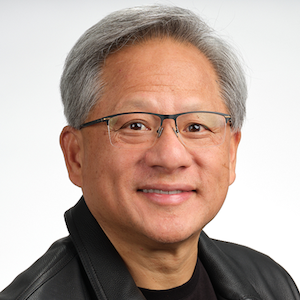
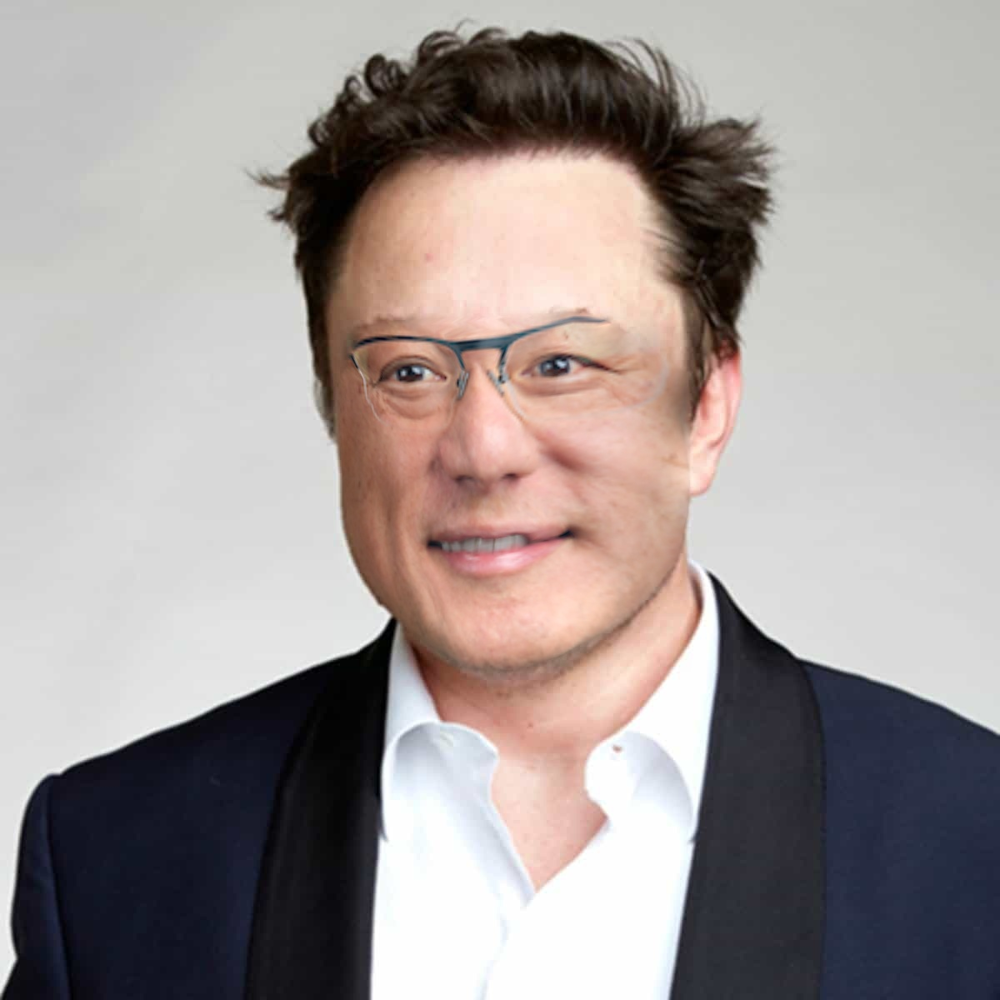

# Face-Swap
This project performs high-quality face swapping between two portrait images using facial landmark detection, Delaunay triangulation, affine transformation, and OpenCV's seamless cloning. The result is a naturally blended face swap that preserves identity while adapting lighting and skin tone seamlessly.

| Elon Musk | Jensen Huang |
|--------|---------|
|  |  |

| Jensen Elon | Elon Jensen |
|--------|---------|
|  |  |

## Tech :hammer_and_wrench: Languages and Tools :

<div>
  &nbsp;
  &nbsp;
  &nbsp;
  &nbsp;
  &nbsp;
  &nbsp;
  &nbsp;
</div>

- Python : Popular language for implementing Neural Network
- Jupyter Notebook : Best tool for running python cell by cell
- Google Colab : Best Space for running Jupyter Notebook with hosted server
- OpenCV : Best Library for working with images
- Numpy : Best Library for working with arrays in python
- MatPlotLib : Library for showing the charts in python
- Dlib : Library for detecting and extracting features of human face

## 💻 Run the Notebook on Google Colab

You can easily run this code on google colab by just clicking this badge [](https://colab.research.google.com/github/AsadiAhmad/Face-Swap/blob/main/Code/Face_Swap.ipynb)

## 🧠 Models Used

1. Dlib’s Face Detector
- Model type: Histogram of Oriented Gradients (HOG)-based face detector.
- Purpose: Detects faces in an image.
- Details: It’s a pre-trained traditional machine learning model optimized for frontal face detection.
- 
2. Dlib’s Facial Landmark Predictor (68 landmarks)
- Model file: shape_predictor_68_face_landmarks.dat
- Model type: Ensemble of Regression Trees (ERT)
- Purpose: Detects 68 facial landmark points including eyes, nose, mouth, jawline, and eyebrows.
- Usage: Used to identify key facial structure for alignment and swapping.
- Pre-trained on: iBUG 300-W dataset.

## 🧮 Algorithms

1. Convex Hull & Delaunay Triangulation
- Purpose: Define a mesh over the face to ensure local geometric consistency during warping.
- Used for: Dividing face into triangles for precise affine transformations.

2. Affine Warping
- Purpose: Warps each triangle from source to target face using affine transformation.
- Method: cv.getAffineTransform() and cv.warpAffine().

3. Seamless Cloning
- Function: cv.seamlessClone()
- Mode: cv.NORMAL_CLONE
- Purpose: Blends the warped face into the background smoothly without visible seams.
- Based on: Poisson image editing.

## 📝 Tutorial

### Step 1: Import Libraries

```python
import numpy as np
import cv2 as cv
import dlib
import matplotlib.pyplot as plt
```

### Step 2: Download Resources

```sh
!wget http://dlib.net/files/shape_predictor_68_face_landmarks.dat.bz2 -O shape_predictor_68_face_landmarks.dat.bz2
```

```sh
!wget https://raw.githubusercontent.com/AsadiAhmad/Face-Swap/main/Pictures/jensen_huang.jpg -O jensen_huang.jpg
!wget https://raw.githubusercontent.com/AsadiAhmad/Face-Swap/main/Pictures/elon_musk.jpg -O elon_musk.jpg
```

### Step 3: Extract .bz2

```cmd
!bunzip2 shape_predictor_68_face_landmarks.dat.bz2
```

### Step 4: Load Images

```python
jensen_huang = cv.imread('jensen_huang.jpg')
elon_musk = cv.imread('elon_musk.jpg')
```

<div display=flex align=center>
  
  
</div>

### Step 5: Grayscale Images

```python
jensen_huang_gray = cv.cvtColor(jensen_huang, cv.COLOR_BGR2GRAY)
elon_musk_gray = cv.cvtColor(elon_musk, cv.COLOR_BGR2GRAY)
```

<div display=flex align=center>
  
  
</div>

### Step 6: Load face detector

```python
face_detector = dlib.get_frontal_face_detector()
```

### Step 7: Facial Landmark Predictor

```python
landmark_predictor = dlib.shape_predictor("shape_predictor_68_face_landmarks.dat")
```

### Step 8: Detecting Faces

```python
def detect_faces(grayscale):
    faces = face_detector(grayscale)
    return faces
```

```python
jensen_huang_faces = detect_faces(jensen_huang_gray)
elon_musk_faces = detect_faces(elon_musk_gray)
```

### Step 9: Extract Facial Landmark

```python
def extract_facial_landmark(image, grayscale, faces):
    facial_landmark = image.copy()

    for face in faces:
        landmarks = landmark_predictor(grayscale, face)
        points = np.array([[p.x, p.y] for p in landmarks.parts()])

        for n in range(0, 68):
            x = landmarks.part(n).x
            y = landmarks.part(n).y
            cv.circle(facial_landmark, (x, y), 5, (0, 255, 0), -1)
    return points, facial_landmark
```

```python
jensen_huang_landmarks, jensen_huang_facial_landmark = extract_facial_landmark(jensen_huang, jensen_huang_gray, jensen_huang_faces)
elon_musk_landmarks, elon_musk_facial_landmark = extract_facial_landmark(elon_musk, elon_musk_gray, elon_musk_faces)
```

<div display=flex align=center>
  
  
</div>

### Step 10: Find Convex Hull

```python
def find_convex_hull(image, faces, landmarks):
    convex_hull_image = image.copy()
    for face in faces:
        hull_indices = cv.convexHull(landmarks, returnPoints=False)
        hull_points = landmarks[hull_indices[:, 0]]

        cv.polylines(convex_hull_image, [hull_points], isClosed=True, color=(0, 0, 255), thickness=3)
    return convex_hull_image, hull_points
```

```python
convex_hull_jensen_huang, hull_points_jensen_huang = find_convex_hull(jensen_huang, jensen_huang_faces, jensen_huang_landmarks)
convex_hull_elon_musk, hull_points_elon_musk = find_convex_hull(elon_musk, elon_musk_faces, elon_musk_landmarks)
```

<div display=flex align=center>
  
  
</div>

### Step 11: Get Delaunay Triangles

```python
def get_delaunay_triangles(rect, points):
    points = np.array(points, dtype=np.float32)

    subdiv = cv.Subdiv2D(rect)
    for p in points:
        subdiv.insert((float(p[0]), float(p[1])))

    triangle_list = subdiv.getTriangleList()
    delaunay_triangles = []

    for t in triangle_list:
        pts = np.array([[t[0], t[1]], [t[2], t[3]], [t[4], t[5]]], dtype=np.float32)

        idx = []
        for i in range(3):
            for j, p in enumerate(points):
                if np.linalg.norm(p - pts[i]) < 1.0:  # tolerance
                    idx.append(j)
                    break
        if len(idx) == 3:
            delaunay_triangles.append(tuple(idx))

    return delaunay_triangles
```

```python
jensen_huang_rect = (0, 0, jensen_huang.shape[1], jensen_huang.shape[0])
elon_musk_rect = (0, 0, elon_musk.shape[1], elon_musk.shape[0])

delaunay_triangles_jensen_huang = get_delaunay_triangles(jensen_huang_rect, jensen_huang_landmarks)
delaunay_triangles_elon_musk = get_delaunay_triangles(elon_musk_rect, elon_musk_landmarks)
```

### Step 12: Affine warp triangles

```python
def warp_triangle(img1, img2, t1, t2):
    r1 = cv.boundingRect(np.float32([t1]))
    r2 = cv.boundingRect(np.float32([t2]))

    t1_rect = []
    t2_rect = []

    for i in range(3):
        t1_rect.append(((t1[i][0] - r1[0]), (t1[i][1] - r1[1])))
        t2_rect.append(((t2[i][0] - r2[0]), (t2[i][1] - r2[1])))

    mask = np.zeros((r2[3], r2[2], 3), dtype=np.uint8)
    cv.fillConvexPoly(mask, np.int32(t2_rect), (1, 1, 1), 16, 0)

    img1_crop = img1[r1[1]:r1[1]+r1[3], r1[0]:r1[0]+r1[2]]
    img1_crop = np.float32(img1_crop)

    mat = cv.getAffineTransform(np.float32(t1_rect), np.float32(t2_rect))
    warped = cv.warpAffine(img1_crop, mat, (r2[2], r2[3]), flags=cv.INTER_LINEAR, borderMode=cv.BORDER_REFLECT_101)
    warped *= mask
    img2[r2[1]:r2[1]+r2[3], r2[0]:r2[0]+r2[2]] = img2[r2[1]:r2[1]+r2[3], r2[0]:r2[0]+r2[2]] * (1 - mask) + warped
```

### Step 13: Sawp Faces

```python
def align_faces(face_image, background_image, delaunay_triangles_background, hull_points_face, hull_points_background):
    warped_image = np.copy(background_image)

    for tri in delaunay_triangles_background:
        if max(tri) >= len(hull_points_face) or max(tri) >= len(hull_points_background):
            continue
        t1 = [hull_points_face[i] for i in tri]
        t2 = [hull_points_background[i] for i in tri]
        warp_triangle(face_image, warped_image, t1, t2)

    return warped_image
```

```python
swap1 = align_faces(jensen_huang, elon_musk, delaunay_triangles_elon_musk, jensen_huang_landmarks, elon_musk_landmarks)
swap2 = align_faces(elon_musk, jensen_huang, delaunay_triangles_jensen_huang, elon_musk_landmarks, jensen_huang_landmarks)
```

<div display=flex align=center>
  
  
</div>

### Step 14: Prepare for Seamless Cloning

```python
def apply_seamless_clone(warped_face, target_image, hull_points):
    mask = np.zeros(target_image.shape, dtype=target_image.dtype)
    cv.fillConvexPoly(mask, cv.convexHull(hull_points), (255, 255, 255))

    r = cv.boundingRect(cv.convexHull(hull_points))
    center_point = (r[0] + r[2] // 2, r[1] + r[3] // 2)

    output = cv.seamlessClone(warped_face, target_image, mask, center_point, cv.NORMAL_CLONE)
    return output
```

```python
jensen_elon = apply_seamless_clone(swap1, elon_musk, hull_points_elon_musk)
elon_jensen = apply_seamless_clone(swap2, jensen_huang, hull_points_jensen_huang)
```

<div display=flex align=center>
  
  
</div>

### Step 15: Store Images

```python
cv.imwrite('jensen_elon.jpg', jensen_elon)
cv.imwrite('elon_jensen.jpg', elon_jensen)
```

### Step 16: Show Images

```python
plt.figure(figsize=[10, 10])
plt.subplot(221),plt.imshow(elon_musk[...,::-1]),plt.title('elon_musk');
plt.subplot(222),plt.imshow(jensen_huang[...,::-1]),plt.title('jensen_huang');
plt.subplot(223),plt.imshow(jensen_elon[...,::-1]),plt.title('jensen_elon');
plt.subplot(224),plt.imshow(elon_jensen[...,::-1]),plt.title('elon_jensen');
```

<div display=flex align=center>
  
</div>


## 🪪 License

This project is licensed under the MIT License.
